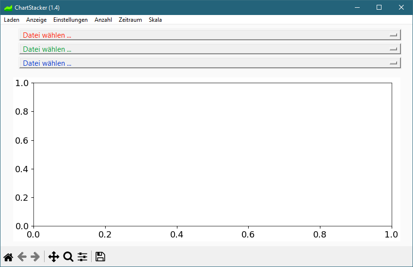

## ChartStacker 

Möglichkeit Kursdaten zu stapeln um die Gesamtentwicklung zu analysieren.

### Start

**Mit Python**  
Für alle im Header von **ChartStacker.py** aufgeführten, benötigten Pakete, Prüfen ob sie in der Python Distribution installiert sind (`python -m pip show <package>`) und Installieren wenn nicht (`python -m pip install <package>`). Wenn alle Voraussetzungen erfüllt sind, mit `python ChartStacker.py` ausführen.

**Executable für Windows-Benutzer**  
Für Windows-Benutzer ist unter Releases eine ZIP-Datei mit kompiliertem Programm verfügbar. Herunterladen, Entzippen und **ChartStacker.exe** ausführen.

### Verwendung
Unter `Laden` kann ein Pfad ausgewählt werden, anschließend unter `Datei wählen` eine Datei, idealerweise mit folgendem Format einer Zeile: `18.10.2024;314,15`, also ein Datum und ein Kurs/Kontostand. Die Daten der Datei sollten nach Auswahl direkt angezeigt werden. Unter den anderen `Datei wählen`-Feldern können weitere Dateien ausgewählt werden. 

Unter `Zeitraum` kann die x-Achse, unter `Skala` die y-Achse manipuliert werden. `Anzahl` ist die Anzahl der auswählbaren Dateien. `Einstellungen` ändert den Umgang mit den vorhandenen Daten, `Anzeige` ändert nur die Grafik.

Unter `Anzeige` gibt es eine Option `Kommentare`. Findet das Programm eine weitere Textdatei mit der Endung `_Kommentare` oder `_comments`, wird diese zum Kommentieren der Daten verwendet. Eine Zeile dieser Datei könnte lauten `18.10.2024;3141,5;-320;Amazon`, was zu einem Kommentar "Amazon" am 18.10.2024 bei y=3141,5 mit der Gewichtung 320 führen würde. Die Gewichtung definiert die Größe und Helligkeit der Kommentar-Labels. Die Option `Beträge` funktioniert nach der gleichen Datei, zeigt aber die Beträge (hier 320) statt der Kommentare (Amazon) an. Es können auch beide ausgewählt werden.

### Einstellungen
- `Daten an gleichen Tagen verteilen`: Verteilt die einzelnen Transaktionen eines Tages einfach leicht, sodass nicht nur ein großer, gemeinsamer Sprung zu sehen ist.
- `Stapeln`: Bei mehreren ausgewählten Dateien werden die Daten aufeinander gestapelt, um die Gesamtentwicklung analysieren zu können.
- `Übertrag von ausgeblendeten Mengen`: Ist die relative Entwicklung einer Kurve klein, kann man mit nur einer Kurve den y-Bereich einschränken, um sie dennoch sehen zu können. Das Funktioniert beim Stapeln normalerweise nicht mehr, da man zwei Entwicklungen betrachten will, die auf der y-Achse aber ggf. weit auseinanderliegen. Um dennoch beide Entwicklungen, die der unteren Kurve und die Gesamtentwicklung, betrachten zu können, kann mit dieser Funktion der konstante Betrag der oberen Kurve auf die untere übertragen werden. Dann ist zwar er Absolutwert der unteren Kurve verfälscht, aber der Gesamt-Absolutwert passt noch, und beide Entwicklungen sind ersichtlich.
- `Normieren` setzt das Maximum jeder Kurve auf 1, solange `Stapeln` nicht ausgewählt ist. Ansonsten wird das Maximum des Stapels auf 1 gesetzt. Da man normalerweise zwischen Stapeln ohne Normieren und Normieren ohne Stapeln hin- und herwechseln möchte, toggelt diese Option das Stapeln.
- `Offset` versetzt die Kurven bei Normieren zusätzlich relativ zueinander.
